# ✺ flove · Backend Implementation Plan

> Living document.  Captures the design decisions, architecture and
> phased roadmap for turning the constellation of flove demos into a
> portable, local-first system that can publish to **0asis** and to
> other distributed platforms in the future.

Status: **draft v0.1** · Owner: Rafael · Updated: 2026-05-04

---

## 0 · Executive summary

**flove** is a local-first constellation of small client-side apps
expressing a relational worldview ("flow + love").  This plan turns
that constellation into a backed-by-the-network experience **without
breaking its local-first nature**.

Two principles drive every decision:

1. **Local-first.** Nothing leaves the user's device unless they
   explicitly publish.  Copy / Save / Share buttons make the user
   the owner of their data.
2. **Platform-portable.** flove is not a back-end; it is a *semantic
   layer* over distributed platforms.  The reference implementation
   targets [**0asis**](https://0asis.net) (an SSB-style mesh with
   40+ built-in modules), but a `Publisher` adapter keeps the door
   open for ActivityPub, Matrix, Solid, etc.

The end-state is a **polysemic dictionary** built from the bottom up:
every published element becomes a multi-rated, multi-related object
in a community-curated vocabulary, searchable via an AI fine-tuned on
the flove corpus (the `whole.html` taxonomy + the fuzzy primitives).

---

## 1 · Decisions already closed

| # | Topic | Decision |
|---|---|---|
| 1.1 | Accounts | No registration to use; an account appears **only when publishing** |
| 1.2 | Fuzzy protocol | A multi-dimensional, relational, polysemic annotation system on user-defined objects (1–7 bipolar scales × 7 axes × sensory meta-raters × multi-rater aggregation × polarity / confluence / triad / combo primitives × WISE epistemic framework) |
| 1.3 | Backend of reference | **0asis.net** — third-party, distributed, local-first, with Market / Tribes / Parliament / Feeds / DM / IA module 42 ready to use |
| 4.1 | What is an "element" | A **fuzzy object** OR a **person/bond** |
| 4.2 | Cross-app sharing | **Common pool** PLUS **direct field-to-field cross-links** between specific apps |
| 4.3 | Common area priority | Semantic AI search → whole-matrix → graph → feed |
| 4.4 | Traceability scope | Only over **published** elements.  Local data never crosses out of the browser |
| 5.1 | Forms quick-win | All of: persist, export/import, cross-link, publish |
| 5.3 | Local persistence | **Copy / Save / Share** buttons in every input — the user owns the data via clipboard / file / share |
| 5.4 | Cross-link example (canonical) | A `loves` act of type *gift* automatically appears in the **Market** of 0asis |
| 6.1 | What 0asis brings out-of-the-box | Identity (crypto-local), storage (ssb-blobs), federation (gossip mesh), 40+ feature modules, public PUBs |
| 6.2 | AI strategy | 0asis ships **module 42** (AI); flove **fine-tunes** it with its corpus.  Used both for **search** and for **suggestions** (polarities, ratings) |
| 6.3 | Visibility model | Inherited from 0asis (local until federated) |
| 6.4 | Additional thematic views | **Messages** (DM) and **Forum** (Tribes) reused from 0asis |
| 7   | Scope of flove vs 0asis | flove is a **portable semantic layer**.  0asis is the first concrete implementation, not the only possible one |

---

## 2 · Architecture overview

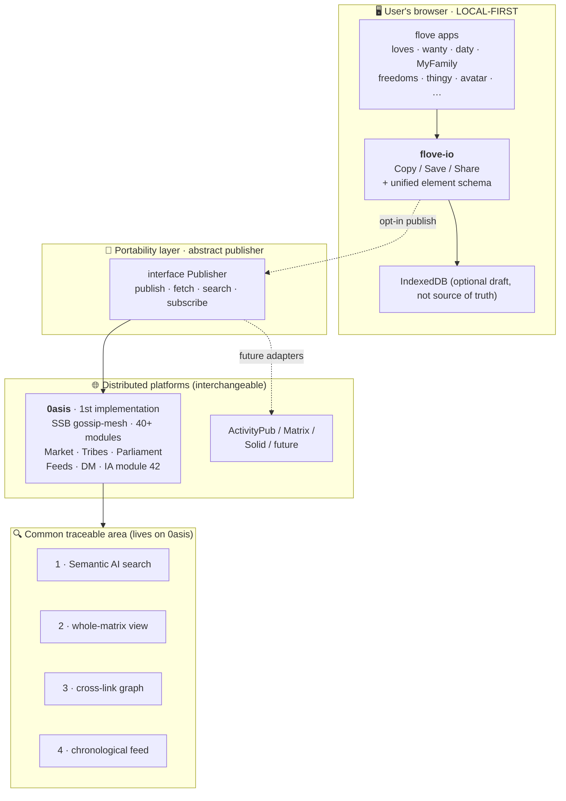

**Key:** the dotted arrow `opt-in publish` is dotted because publishing
is always a deliberate user act.  Local data is never auto-uploaded.

---

## 3 · The flove element

A single schema flows through every app, every adapter, every view.
Section 3 fixes both the **upper ontology** (what kinds of things
exist) and the **wire shape** of a `FloveElement` used by `flove-io`,
the Publisher adapter and the common area.

### 3.1 · Upper ontology — universal classes

Every concrete app field maps to one of a small set of universal
classes. Apps may add their own subclasses, but the upper classes are
the only thing the common-area views, the cross-link graph and module
42 are required to understand.

| Class      | What it represents                                  | Example emitting apps              |
|------------|-----------------------------------------------------|------------------------------------|
| `Act`      | An action performed by a person on/with something   | loves (gift), thingy (offer)       |
| `Wish`     | A desire / pending act                              | thingy (need/want), wanty (essence)|
| `Bond`     | A relationship between two persons                  | MyFamily, daty                     |
| `Place`    | A spatial location (point or region)                | openastro, MyFamily, daty          |
| `Person`   | A human (self or other), pseudonymous OK            | MyFamily, daty, avatar             |
| `Time`     | A point or interval in time                         | daty, openastro, fictio            |
| `Object`   | A thing/concept being rated or referenced           | rate, fictio                       |
| `Freedom`  | A declared right or boundary                        | freedoms, hackboth, diesafe        |
| `Rating`   | A fuzzy annotation (see §8)                         | rate, any other app via attach     |

Mapping rule: every leaf field of every app declares which universal
class it carries. This is what lets the common area treat fields from
different apps as queryable peers.

### 3.2 · Per-app mapping

Each app ships a small `mapping.json` next to its HTML that declares,
for every field name, which upper class the field carries:

```json
{
  "app": "loves",
  "type": "act",
  "subtype": "gift",
  "fields": {
    "from":    { "class": "Person", "vocab": "person",  "free_tags": false },
    "to":      { "class": "Person", "vocab": "person",  "free_tags": false },
    "thing":   { "class": "Object", "vocab": "object",  "free_tags": true  },
    "context": { "class": "Place",  "vocab": "place",   "free_tags": false },
    "motive":  { "class": "Wish",   "vocab": "essence", "free_tags": false }
  }
}
```

This file is the bridge between the app's free-form HTML and the
upper ontology; `flove-io` reads it to populate `FloveElement.fields`
correctly.

### 3.3 · Vocabulary policy

Three vocabulary modes, declared per field in `mapping.json`:

| Mode              | Meaning                                                          | Updateable by                  |
|-------------------|------------------------------------------------------------------|--------------------------------|
| `closed`          | Versioned canonical list; only project releases add terms        | flove release                  |
| `closed + IA-sug` | Same as closed but module 42 may **suggest** new terms inline    | flove release (after curation) |
| `free`            | User-typed tags, no validation, indexed as-is                    | every user                     |

`free_tags: true` on a field opts that field into the `free` mode in
addition to its declared closed vocabulary. Module 42 suggestions are
always proposals — a release cycle decides whether they enter the
canonical list.

### 3.4 · `asterism_path` per sub-field

Every field carries its **own** coordinate inside the `whole.html`
taxonomy, not just the element as a whole. This lets a single element
appear simultaneously in several cells of the whole-matrix view (one
per field) and lets cross-link search hit the right granularity.

```json
{
  "asterism_path": "puzzy/relate/rate",
  "fields": {
    "subject": { "class": "Object", "value": "TRUE",
                 "asterism_path": "puzzy/relate/rate/subject" },
    "anchor":  { "class": "Object", "value": "LOVE",
                 "asterism_path": "puzzy/relate/rate/anchor" }
  }
}
```

### 3.5 · `FloveElement` schema (canonical)

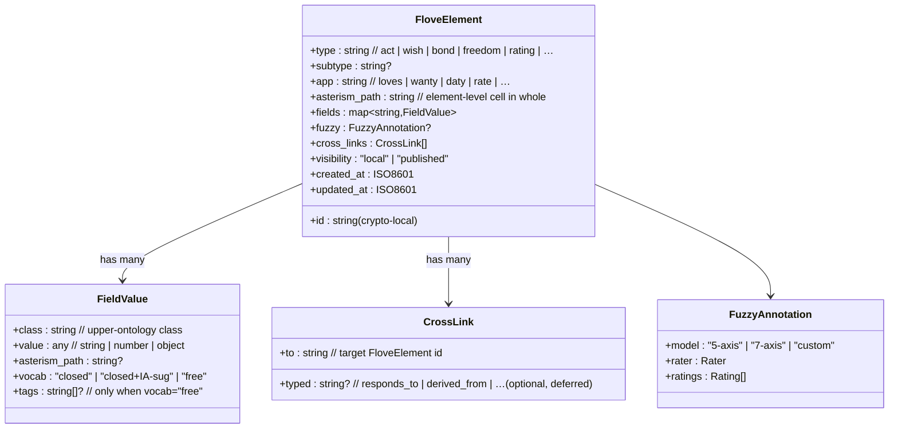

The element written by `flove-io.snapshot()` (F0) already follows the
top-level shape; what §3 adds is the per-field metadata, the upper
class mapping and the per-sub-field `asterism_path`.

---

## 4 · Element life cycle

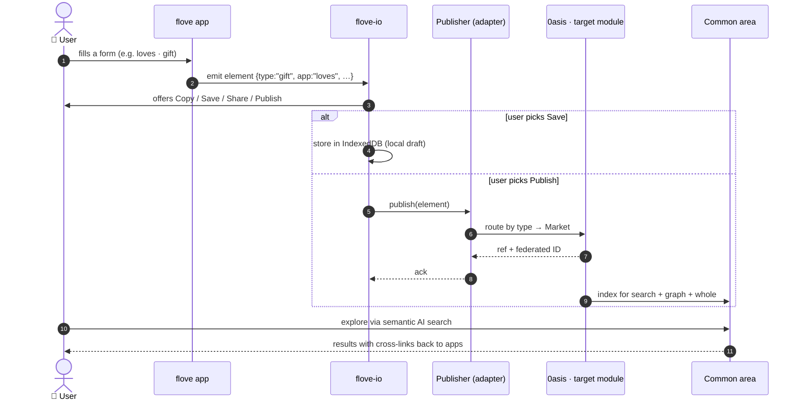

---

## 5 · Routing (apps → 0asis modules)

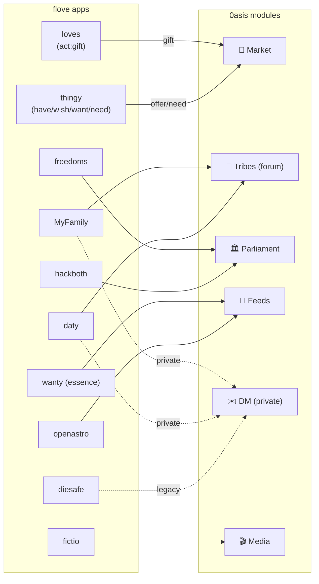

This map lives as a **declarative `routing.json`** file, never as
hard-coded logic inside each app.

---

## 6 · Publisher adapter (portability)

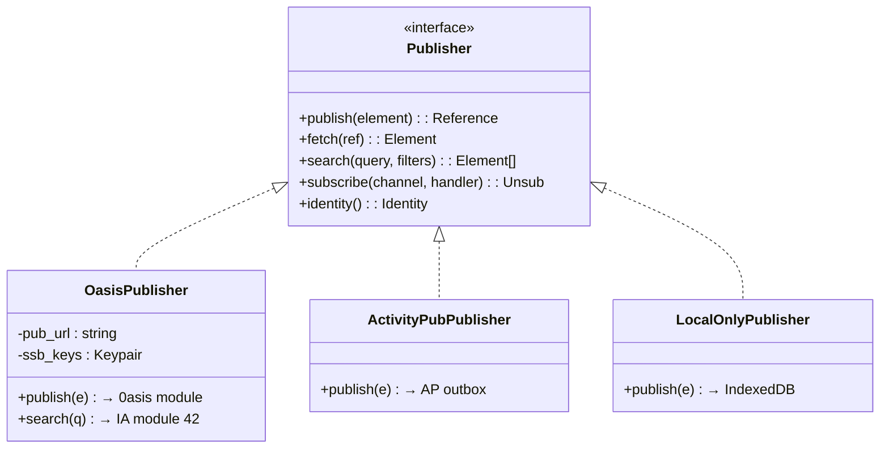

One interface, three implementations.  The app never knows which one
is running.

---

## 7 · Common traceable area

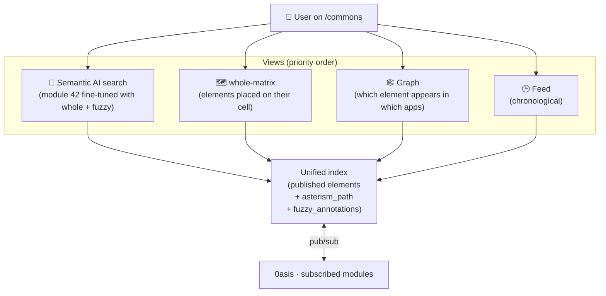

---

## 8 · Fuzzy engine

The fuzzy engine is the part of flove that lets a rater express how an
object stands in relation to other objects, along several axes at
once, with sensory grounding and the option for several raters to
contribute distinct annotations.

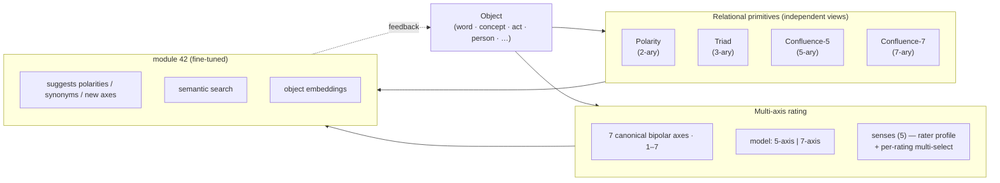

### 8.1 · The seven canonical bipolar axes

The seven axes are **universal** — the same axes apply to every kind
of object. They are taken from the original `Puzzy/Relate/Rate`
prototype, now ported to `~/flove-demos/rate.html`:

| # | Left pole  | Mid (if any) | Right pole  |
|---|------------|--------------|-------------|
| 1 | INTENSE    | EQUAL        | BANAL       |
| 2 | SIMILAR    | COMPLEMENT   | DIFFERENT   |
| 3 | ABSTRACT   | —            | CONCRETE    |
| 4 | POSITIVE   | —            | NEGATIVE    |
| 5 | CLOSE      | —            | FAR         |
| 6 | PRIMARY    | —            | SECONDARY   |
| 7 | UNKNOWN    | —            | KNOWN       |

Each axis takes an integer **1–7**. Axes 1 and 2 carry a meaningful
mid-value; on the other five, 4 means "balanced / undecided". Users
may add custom axes; module 42 suggests new axis pairs as the corpus
grows.

### 8.2 · 5-axis and 7-axis are different relational models

The two cardinalities are **distinct relational levels, not nested**: a
5-axis rating is *not* a 7-axis rating with two missing values. An
element is rated under exactly one model and the snapshot records
which one in `fuzzy.model`. The reference UI exposes this as a
top-level toggle.

### 8.3 · Relational primitives — levels and views

Three primitives operate over the same object simultaneously, each at
a different relational cardinality and each presented as an
**independent view** in the common area:

| Primitive    | Cardinality | View question                                       |
|--------------|-------------|-----------------------------------------------------|
| Polarity     | 2-ary       | What is its opposite?                               |
| Triad        | 3-ary       | What three terms form a complete relational frame?  |
| Confluence   | 5- or 7-ary | What family of complementary opposites holds it?    |

Confluence at 5 and at 7 are **distinct levels** (mirroring §8.2).
**Combos** are explicitly **out of the standard**: each app may run
its own combinatorial generator over selected words, but combos are
not part of the inter-app schema.

### 8.4 · Senses — dual plane

The five senses (`hear · touch · view · taste · smell`) operate on
two planes at once:

1. **Rater profile.** Each rater declares the senses they relate to.
   This is a property of the rater, persisted alongside the
   `pubkey` in their identity.
2. **Per-rating meta-rater.** Inside any single rating, the rater
   multi-selects which of their declared senses informed *that*
   particular rating.

A sense the rater has not declared in their profile cannot be selected
on a rating; the reference UI dims those pills to make this visible.

### 8.5 · Multi-select within one rater

In flove, "multi-rater" means **multi-selection inside a single
rater's annotation** — multiple senses, multiple terms, multiple
confluence members. Each human contributes one and only one
annotation per element; aggregation across human raters in the common
area is **deferred** (see §8.8).

### 8.6 · `FuzzyAnnotation` schema

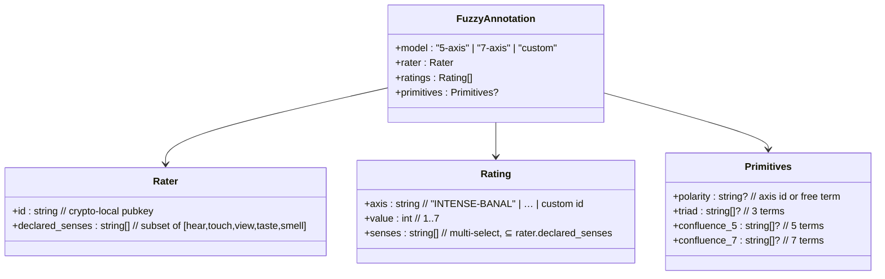

### 8.7 · Reference UI

`~/flove-demos/rate.html` is the canonical implementation:

- Pure-CSS tabs and pills (radio + `:checked`, checkbox + `:has`); JS
  is used only to render the live phrase and build the snapshot.
- Top-level toggle for 5-axis / 7-axis model.
- Rater profile bar declaring senses.
- Per-axis multi-select sense pills, dimmed for senses absent from the
  rater profile.
- Wired through `flove-io.bind()` with a custom `snapshot` that emits
  exactly the `FuzzyAnnotation` shape above.

### 8.8 · Open questions (specific to fuzzy)

- **Aggregation across human raters** — what does the common area
  show when several people rate the same object? (yuxtaposition ·
  mean + dispersion · toggle). Decision deferred to F4 / F6.
- **Where the fuzzy compute lives** — client-only / module-42-only /
  hybrid with offline cache. Deferred until F5 starts.
- **Which app fields admit free tags** — declared per-app in
  `mapping.json`; the canonical catalogue will be filled when each
  app ships its mapping (F1 deliverable).

---

## 9 · Phased roadmap

| Phase | Main deliverable | Optional add-ons that fit this layer |
|---|---|---|
| **F0 · Local-first UX** | `flove-io` with unified Copy / Save / Share in every input | • Auto-draft to IndexedDB · • Exportable `.flove.json` templates · • Unified voice dictation (Web Speech) · • Offline-first badge |
| **F1 · App→module routing** | declarative `routing.json` | • Visual editor for non-devs · • Per-module type validator · • Multi-destination per element · • Pre-publish hooks (anonymise fields) |
| **F2 · Publisher adapter** | `Publisher` interface + `OasisPublisher` | • `LocalOnlyPublisher` for tests · • `MockPublisher` with demo data · • Offline retry queue · • Multi-publisher (0asis + AP at once) |
| **F3 · Identity + publish** | "Publish" button with destination preview | • Multiple pseudonyms ("masks") per context · • Element revocation · • Diff confirmation before publish · • Share via QR / ephemeral link |
| **F4 · Common area** | Semantic search + whole + graph + feed | • Sense-based filters · • Permalink to a whole cell · • Activity heatmap per cell · • "Your footprint" personal view |
| **F5 · Fine-tuned AI** | module 42 trained with `whole` + fuzzy seeds | • Polarity suggestions while filling forms · • Auto-tagging of `asterism_path` · • Semantic duplicate detection · • Per-cell community summary |
| **F6 · Full fuzzy engine** | Multi-axis ratings + multi-rater + primitives | • "Consensus vs dissent" view per object · • Temporal trajectories of a rating · • Rater reputation (un-gamified) · • Combo generator for creative inspiration |

---

## 10 · F0 detail — `flove-io` (local-first UX)

### 10.1 · Goal

Give every form in every flove app the same four-button action bar
(**Copy · Save · Share · Publish**) so the user is the owner of the
data, with **zero build step** and **no framework dependency**.

### 10.2 · Design constraints

- **Vanilla JS** ES module (works in any modern browser straight from
  `<script type="module">`).  No bundler, no transpiler.
- **Zero dependencies.**  Uses only Web platform APIs (Clipboard,
  Blob/URL, Web Share, IndexedDB).
- **Progressive enhancement.**  If `Publisher` is not connected, the
  Publish button is hidden — the rest still works.
- **Granularity = one action bar per form**, not per `<input>`.
  The form is the natural unit of a flove element.

### 10.3 · Component anatomy

```mermaid
flowchart TB
    FORM["<form data-flove-app=… data-flove-type=…>"]
    HOOK["floveIO() · entry function"]
    SCHEMA["Element schema validator"]
    BAR["<flove-action-bar>"]
    COPY["📋 Copy"]
    SAVE["💾 Save"]
    SHARE["🔗 Share"]
    PUB["✺ Publish"]
    EVENT["CustomEvent 'flove:emit'"]
    DRAFT["IndexedDB draft (opt-in)"]
    PUBLISHER["Publisher adapter (F2)"]

    FORM --> HOOK
    HOOK --> SCHEMA
    HOOK --> BAR
    BAR --> COPY
    BAR --> SAVE
    BAR --> SHARE
    BAR --> PUB
    COPY --> EVENT
    SAVE --> EVENT
    SHARE --> EVENT
    PUB --> EVENT
    HOOK -. opt-in .-> DRAFT
    PUB -. when wired .-> PUBLISHER
```

### 10.4 · Public JS API

```js
import { floveIO } from './flove-io.js';

const io = floveIO({
  publisher: null,            // optional, F2 onwards
  draft:     'indexeddb',     // 'indexeddb' | 'memory' | 'off'
  onEmit:    (el, action) => {/* hook */},
});

io.attach(document.querySelector('#love-act'));
io.detach(formEl);
io.snapshot(formEl);          // returns the FloveElement object
```

### 10.5 · Form contract (HTML conventions)

A form opts in to flove-io by declaring metadata as `data-*`
attributes — no JS config per app:

```html
<form id="love-act"
      data-flove-app="loves"
      data-flove-type="act"
      data-flove-subtype="gift"
      data-flove-asterism="Gift/Wish/Freed"
      data-flove-fuzzy="optional">
  <input name="what" required>
  <input name="to_whom">
  <select name="scope">…</select>
  <!-- flove-io injects <flove-action-bar/> here -->
</form>

<script type="module">
  import { floveIO } from './flove-io.js';
  floveIO().attach(document.querySelector('#love-act'));
</script>
```

`name` of each form field maps 1-to-1 into `element.fields[name]`.
Nested objects via dotted names (`fields.kind` → `kind` inside
`fields`).

### 10.6 · `.flove.json` element file format

The same payload that travels through Copy / Save / Share / Publish:

```json
{
  "$schema": "https://flove.org/schemas/element-v1.json",
  "id":            "loves-act-2026-05-04T18-22-09-7f3a",
  "type":          "act",
  "subtype":       "gift",
  "app":           "loves",
  "asterism_path": "Gift/Wish/Freed",
  "fields": {
    "what":     "a long walk together",
    "to_whom":  "M.",
    "scope":    "intimate"
  },
  "fuzzy":         null,
  "cross_links":   [],
  "visibility":    "local",
  "created_at":    "2026-05-04T18:22:09.412Z",
  "updated_at":    "2026-05-04T18:22:09.412Z"
}
```

### 10.7 · Action button contracts

| Button | Behaviour | Fallback when unsupported |
|---|---|---|
| **Copy** | `navigator.clipboard.writeText(JSON.stringify(element, null, 2))`.  Toast: *"Element copied"* | `<textarea>` + `document.execCommand('copy')` |
| **Save** | Blob → object URL → invisible `<a download="<id>.flove.json">` | Open in a new tab, user saves manually |
| **Share** | `navigator.share({title, text, files:[...]})` if supported | Falls back to Copy + toast |
| **Publish** | Calls `publisher.publish(element)`; shows a destination preview from `routing.json` (F1) | Hidden when no publisher is wired |

### 10.8 · Element ID strategy

Crypto-local: `<app>-<type>-<isoDate>-<6-hex>`.  Stable across edits;
server-side ID assigned at publish time (kept as `published_id`).

### 10.9 · Scope of F0 — STATUS: delivered ✓

| Artifact | Path | Notes |
|---|---|---|
| Module | `~/flove-demos/flove-io.js` | 311 LOC, single ESM file, zero deps |
| Styles | `~/flove-demos/flove.css` | `.flove-action-bar`, `.flove-action-btn`, `.flove-toast--io` appended |
| Demo  | `~/flove-demos/flove-io-demo.html` | Canonical proof: form with `data-flove-*` + injected action bar + live JSON preview |

The module exports a single entry: `floveIO(opts) → { attach, detach, snapshot, bind }`.
IndexedDB draft is opt-in via `{ draft: 'indexeddb' }`.

### 10.10 · F0 add-ons (when there is appetite)

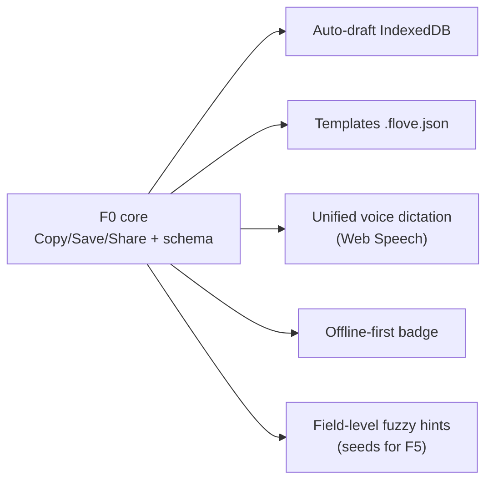

### 10.11 · Integration recipes

**Mode A · `attach` — for new or restructurable apps.**
The form declares its identity via `data-flove-*`; flove-io injects the
action bar inside the form.

```html
<form id="my-form" data-flove-app="loves" data-flove-type="act"
      data-flove-subtype="gift" data-flove-asterism="Gift/Wish/Freed">
  <input name="what">
  <input name="to_whom">
  <select name="scope">…</select>
</form>
<script type="module">
  import { floveIO } from './flove-io.js';
  floveIO().attach(document.querySelector('#my-form'));
</script>
```

**Mode B · `bind` — for legacy apps with existing buttons.**
Apps like `loves.html` already ship a Copy / Share / Publish row with
custom payloads (e.g. the combined "magic phrase").  Don't replace
them — wire flove-io to the same buttons and provide a custom
`snapshot` that returns the payload the app actually wants to emit.

```html
<script type="module">
  import { floveIO } from './flove-io.js';
  const io = floveIO({ publisher: null });
  io.bind({
    form:       '#root',                  // any container with data-flove-*
    copyBtn:    '#copyBtn',
    shareBtn:   '#shareBtn',
    publishBtn: '#publishBtn',
    snapshot:   () => ({                  // custom payload builder
      $schema: 'https://flove.org/schemas/element-v1.json',
      type: 'act', subtype: 'gift', app: 'loves',
      fields: { liked: collectLikedItems() },
      visibility: 'local',
    }),
  });
</script>
```

Both modes share the same `FloveElement` shape, so downstream
(routing, publisher, area common) treats them identically.

---

## 11 · F1 detail — `routing.json` declarative map

### 11.1 · Goal

Decide where every published element goes, **without writing routing
logic inside the apps**.  The map is data, not code.

### 11.2 · Design constraints

- **Single source of truth** for app→module routing.
- **Pattern-matching**, not procedural code.
- **Multi-destination supported**: one element may fan out (e.g. a
  `gift` lands both in Market and in user's personal Feed).
- **Pre-publish hooks** allow anonymisation, redaction or summarising
  before the element leaves the device.

### 11.3 · File location and lifecycle

`~/flove-demos/routing.json` — bundled with the launcher; can be
overridden per-deployment.  Version-pinned via `version` field.

### 11.4 · Grammar (illustrative)

```json
{
  "$schema": "https://flove.org/schemas/routing-v1.json",
  "version": "0.1",
  "routes": [
    {
      "id": "loves-gift-to-market",
      "match": {
        "app":  "loves",
        "type": "act",
        "fields.subtype": "gift"
      },
      "destinations": [
        { "publisher": "oasis", "module": "market", "channel": "gifts" }
      ],
      "hooks": ["anonymise:to_whom"]
    },

    {
      "id": "thingy-offers-to-market",
      "match": {
        "app":  "thingy",
        "type": { "in": ["have", "wish", "want", "need"] }
      },
      "destinations": [
        { "publisher": "oasis", "module": "market" }
      ]
    },

    {
      "id": "myfamily-private",
      "match": { "app": "MyFamily" },
      "destinations": [
        { "publisher": "oasis", "module": "tribes",  "tribe":   "family" },
        { "publisher": "oasis", "module": "dm",      "audience": "self+invited" }
      ],
      "hooks": ["requires_consent"]
    },

    {
      "id": "freedoms-to-parliament",
      "match": { "app": "freedoms" },
      "destinations": [
        { "publisher": "oasis", "module": "parliament" }
      ]
    },

    {
      "id": "fictio-to-media",
      "match": { "app": "fictio" },
      "destinations": [
        { "publisher": "oasis", "module": "media" }
      ]
    }
  ]
}
```

### 11.5 · Pattern matching semantics

| Operator | Meaning |
|---|---|
| literal | exact match |
| `{ "in": [...] }` | value is one of |
| `{ "regex": "..." }` | value matches |
| `{ "exists": true }` | field is present |
| dotted path | traverses `fields.*`, `fuzzy.*` |

First matching route wins.  All matching routes can be triggered if
`{"strategy": "all"}` is set at root.

### 11.6 · Hook catalogue (initial)

| Hook | Effect |
|---|---|
| `anonymise:<field>` | replaces value with stable hash |
| `redact:<field>` | removes the field entirely |
| `summarize:<field>` | calls AI module 42 to produce a short summary |
| `requires_consent` | shows an explicit confirm dialog before send |
| `attach:<view>` | additionally publishes a derived view (e.g. graph node) |

Hooks run in order; each receives the element, returns the modified
element.

### 11.7 · Routing flow

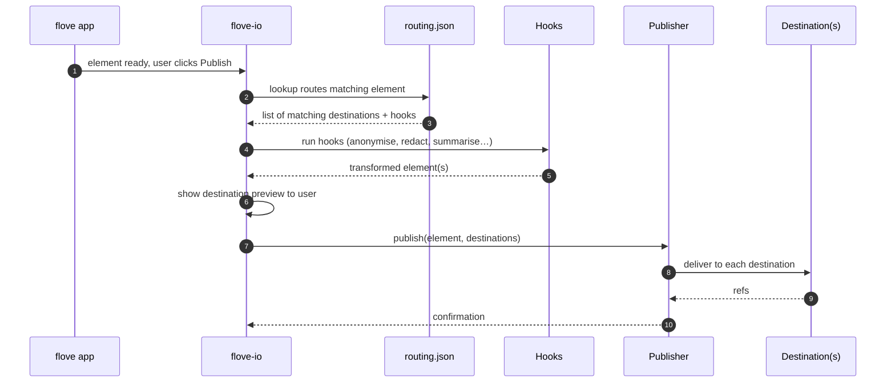

### 11.8 · F1 add-ons (when there is appetite)

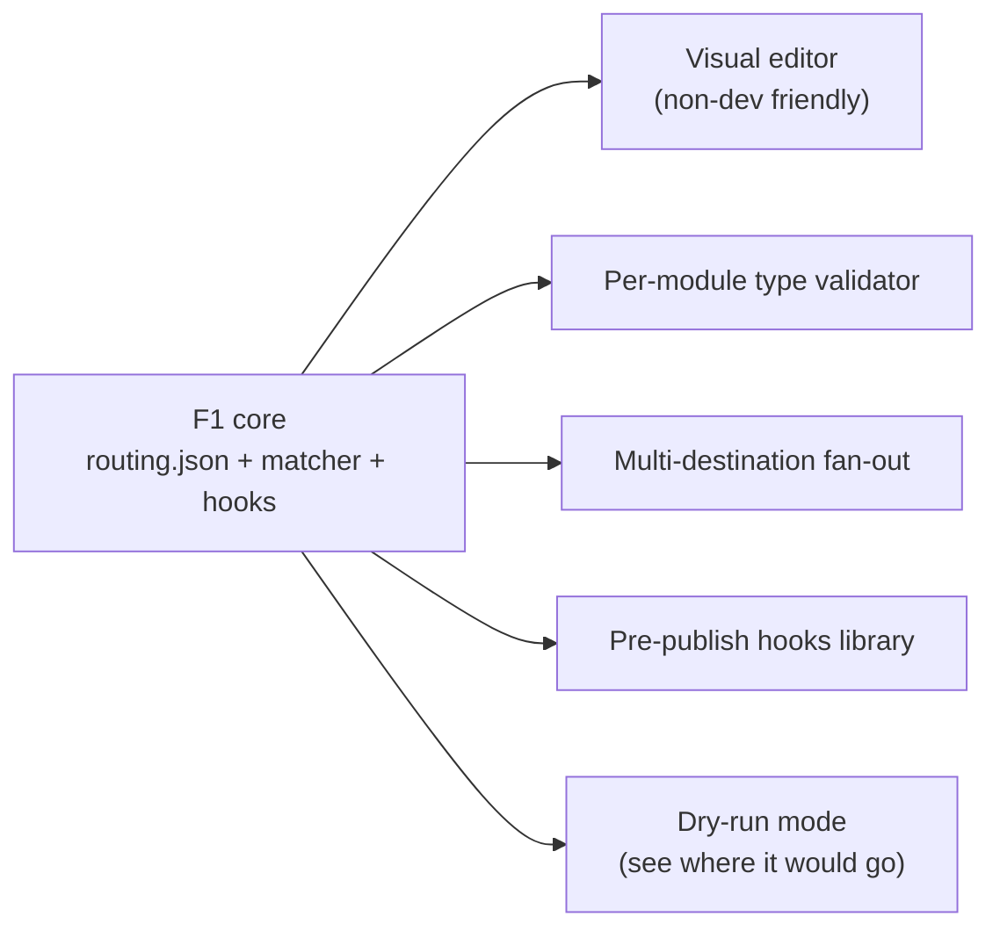

---

## 12 · Open questions (deferred)

- Authoring flow for `routing.json` — community-editable wiki, or
  curator-only?
- AI module 42 fine-tuning workflow — full or LoRA?  Whose compute?
- Identity masks (one user, multiple personae) — needed in F3 or F6?
- Granular visibility per element — "public to my tribes only" — or
  rely on 0asis defaults?
- Cross-link semantics — typed (`responds_to`, `derived_from`) or
  untyped?

These will be revisited as F0 and F1 land.

